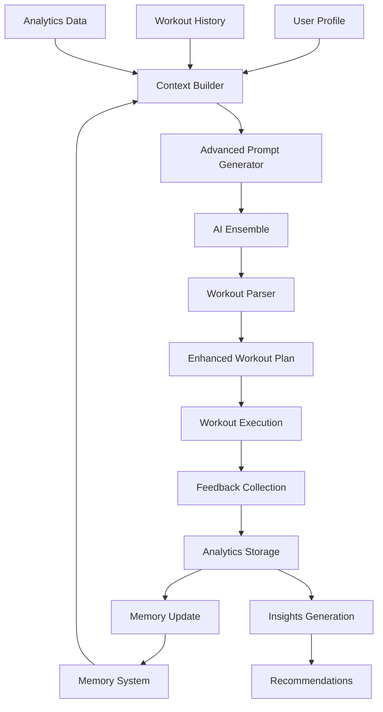

# Enhanced AI Workout Generation System

## Overview

The enhanced workout generation system leverages advanced AI capabilities, memory management, and comprehensive user analytics to create highly personalized and adaptive fitness experiences. This system goes beyond basic profile-based generation to include workout history, performance analytics, and continuous learning.

## Key Features

### 🧠 Memory-Aware AI Context
- **Persistent User Memory**: Stores workout history, preferences, and performance data
- **Session Continuity**: Maintains context across workout sessions
- **Progressive Learning**: AI learns from user feedback and adapts recommendations

### 📊 Comprehensive User Analytics
- **Performance Tracking**: Completion rates, duration efficiency, consistency scores
- **Preference Analysis**: Identifies preferred workout types, muscle groups, and timing
- **Pattern Recognition**: Discovers optimal workout days and times for each user

### 🎯 Advanced Personalization
- **Progressive Overload**: Automatically adjusts difficulty based on user progress
- **Contextual Adaptation**: Considers time of day, energy levels, and recent activity
- **Goal-Specific Programming**: Tailors workouts to specific fitness objectives

### 🔄 Feedback Loop Integration
- **Post-Workout Feedback**: Collects user ratings and subjective measures
- **Performance Analytics**: Tracks objective metrics like completion rates
- **Continuous Improvement**: Uses feedback to refine future workout generation

## System Architecture



## Core Components

### 1. WorkoutGenerator (Enhanced)
**Location**: `src/components/NeuraFit/WorkoutGenerator.tsx`

**Key Enhancements**:
- Comprehensive user context building
- Memory-aware AI prompting
- Enhanced workout parsing with new fields
- Integrated feedback collection

**New Methods**:
- `buildComprehensiveUserContext()`: Aggregates all user data
- `buildAdvancedWorkoutPrompt()`: Creates sophisticated AI prompts
- `calculateWorkoutFrequency()`: Analyzes workout patterns
- `extractUserPreferences()`: Identifies user preferences

### 2. WorkoutFeedback Component
**Location**: `src/components/NeuraFit/WorkoutFeedback.tsx`

**Features**:
- Multi-step feedback collection
- Difficulty and enjoyment ratings
- Perceived exertion (RPE) scale
- Energy level assessment
- Optional comments and suggestions

### 3. WorkoutAnalytics Service
**Location**: `src/services/workoutAnalyticsService.ts`

**Capabilities**:
- Performance metrics calculation
- Trend analysis and pattern recognition
- AI recommendation generation
- Comprehensive insights dashboard

### 4. WorkoutInsights Component
**Location**: `src/components/NeuraFit/WorkoutInsights.tsx`

**Displays**:
- Progress trends and consistency scores
- User preferences and patterns
- Performance analytics
- AI-generated recommendations

## Enhanced Data Models

### WorkoutPlan (Extended)
```typescript
interface WorkoutPlan {
  // Existing fields...
  id: string;
  name: string;
  duration: number;
  exercises: Exercise[];
  difficulty: 'beginner' | 'intermediate' | 'advanced';
  createdAt: Date;
  completedAt: Date | null;
  
  // New enhancement fields
  focusAreas?: string[];
  workoutType?: 'strength' | 'cardio' | 'hiit' | 'flexibility' | 'mixed';
  actualDuration?: number;
  completionRate?: number;
  coachingNotes?: string;
  
  generationContext?: {
    userContext: any;
    aiModelsUsed: string[];
    generationTime: number;
    sessionId: string;
  };
  
  warmUp?: {
    duration: number;
    exercises: string[];
  };
  
  coolDown?: {
    duration: number;
    exercises: string[];
  };
}
```

### Exercise (Extended)
```typescript
interface Exercise {
  // Existing fields...
  name: string;
  sets: number;
  reps: number;
  duration: number;
  restTime: number;
  instructions: string;
  tips: string;
  targetMuscles: string[];
  
  // New enhancement fields
  equipment?: string[];
  intensity?: 'low' | 'moderate' | 'high';
  progressionNotes?: string;
  modifications?: string[];
  safetyNotes?: string;
}
```

## AI Prompt Engineering

### Advanced Prompt Structure
The system uses sophisticated prompts that include:

1. **Role Definition**: Expert AI fitness trainer persona
2. **User Context**: Comprehensive profile and history
3. **Performance Data**: Analytics and progress metrics
4. **Contextual Factors**: Time, day, energy levels
5. **Memory Context**: Previous interactions and preferences
6. **Generation Requirements**: Specific constraints and goals
7. **Progressive Overload Guidance**: Level-appropriate progression
8. **Response Format**: Structured JSON with validation

### Example Prompt Elements
```
You are an expert AI fitness trainer with deep knowledge of exercise science...

## USER PROFILE
- Fitness Level: intermediate (Regular exerciser, ready for moderate challenges)
- Primary Goals: muscle_building, strength
- Available Equipment: dumbbells, resistance_bands
- Time Available: 45 minutes

## WORKOUT HISTORY & PROGRESS
- Total Completed Workouts: 12
- Average Workout Duration: 42 minutes
- Workout Frequency: moderate_frequency
- Recent Performance: consistent_completion

## CONTEXTUAL FACTORS
- Current Time: morning
- Day of Week: Monday
- User Preferences: {"preferredMuscleGroups": ["chest", "back"]}

## MEMORY CONTEXT
User prefers compound movements and has shown good progression in upper body strength...
```

## Memory Management Integration

### Memory Storage Strategy
- **Workout Generation**: Store context and user profile
- **Workout Completion**: Store performance and feedback
- **User Feedback**: Store subjective ratings and comments
- **Progress Milestones**: Store significant achievements

### Memory Retrieval
- **Context Building**: Retrieve relevant workout history
- **Preference Analysis**: Extract user patterns and preferences
- **Performance Trends**: Analyze progress over time

## Analytics and Insights

### Performance Metrics
- **Completion Rate**: Percentage of exercises completed
- **Duration Efficiency**: Actual vs. planned workout time
- **Consistency Score**: Regularity of workout completion
- **Adherence Rate**: Percentage of planned workouts completed

### Pattern Recognition
- **Optimal Performance Times**: Best days and times for workouts
- **Preferred Exercise Types**: Most enjoyed and completed exercises
- **Progression Patterns**: How user responds to difficulty increases

### AI Recommendations
- **Next Workout Suggestions**: Based on recent performance
- **Progression Recommendations**: When and how to increase difficulty
- **Recovery Recommendations**: Rest and recovery guidance
- **Goal Adjustments**: Modifications to fitness objectives

## Implementation Benefits

### For Users
- **Highly Personalized**: Workouts tailored to individual progress and preferences
- **Adaptive**: System learns and improves with each workout
- **Motivating**: Provides insights and celebrates progress
- **Efficient**: Optimizes workout time and effectiveness

### For AI System
- **Continuous Learning**: Improves recommendations over time
- **Context Awareness**: Understands user patterns and preferences
- **Quality Feedback**: Receives detailed performance data
- **Scalable**: Can handle diverse user profiles and goals

## Future Enhancements

### Planned Features
- **Biometric Integration**: Heart rate, sleep, and recovery data
- **Social Features**: Workout sharing and community challenges
- **Advanced Periodization**: Long-term training cycle planning
- **Injury Prevention**: Risk assessment and modification suggestions
- **Nutrition Integration**: Meal planning aligned with workout goals

### Technical Improvements
- **Real-time Adaptation**: Mid-workout difficulty adjustments
- **Voice Integration**: Audio coaching and feedback
- **Wearable Integration**: Real-time performance monitoring
- **Advanced Analytics**: Machine learning for pattern prediction

## Testing and Validation

The system includes comprehensive tests covering:
- AI context building and prompt generation
- Memory integration and retrieval
- Analytics calculation and insights generation
- Feedback collection and processing
- Error handling and fallback scenarios

## Conclusion

The enhanced workout generation system represents a significant advancement in AI-powered fitness technology. By combining comprehensive user data, advanced AI prompting, memory management, and continuous feedback loops, it delivers truly personalized and adaptive workout experiences that improve over time.

This system sets a new standard for intelligent fitness applications, providing users with workouts that are not just personalized, but continuously optimized based on their unique patterns, preferences, and progress.
